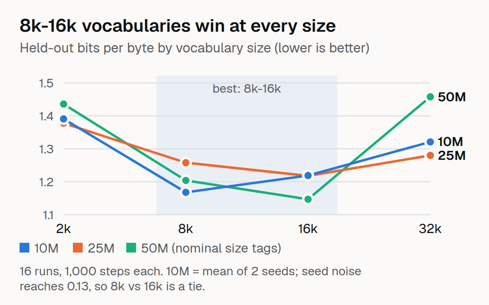

# Vocab Tax



A compute-matched vocabulary-size study for small code models. Train small LLaMA-style decoders from scratch (3 sizes × 4 BPE vocabulary sizes, plus a second seed at the smallest size: 16 runs) on TypeScript/JavaScript and measure, at equal training FLOPs, which vocabulary gives the lowest bits-per-byte.

## The problem

Most portfolios fine-tune someone else's model with someone else's tokenizer. This treats the tokenizer as the variable under test, in the spirit of Tao et al. 2024 ("Scaling Laws with Vocabulary"), in a narrow code domain. It fixes a real weakness in my own work: ORCH-Fusion (2,103 tokens, 272.7M) and ORCH-Next.js-350M-v2 (16,000 tokens, 287M) share a backbone but differ in tokenizer, data and training at once, so today I cannot say whether the small vocabulary helped.

## The approach

1. **Data**: Exact-hash-deduplicated TS/JS shard from codeparrot/github-code-clean
2. **Tokenizers**: 4 byte-level BPE tokenizers (2k, 8k, 16k, 32k vocab) trained on the same bytes
3. **Models**: 3 LLaMA-style sizes (nominal 10M / 25M / 50M tags; real counts below)
4. **Training**: 1,000 steps per run (`configs/grid.yaml`: `epochs: 1`, `max_steps: 1000`)
5. **Evaluation**: Held-out bits-per-byte on TS/JS code
6. **Metric**: bpb = total_nats / (ln 2 × total_bytes) — comparable across tokenizers

## Key design decisions

- **Bits-per-byte, not per-token loss**: Per-token loss is not comparable across tokenizers
- **FLOPs include embedding + output layers**: Tiny vocabularies look deceptively cheap without this
- **Second seed for 10M row**: Shows the noise band; a null result is reported as one
- **No extrapolation beyond the grid**: 3 sizes is fragile for fitting a law

## Grid

| Size | Vocab 2k | Vocab 8k | Vocab 16k | Vocab 32k |
|---|---|---|---|---|
| 10M | ✅ | ✅ | ✅ | ✅ |
| 25M | ✅ | ✅ | ✅ | ✅ |
| 50M | ✅ | ✅ | ✅ | ✅ |
| 10M (seed 2) | ✅ | ✅ | ✅ | ✅ |

## Fertility table

| Vocab size | Tokens per byte |
|---|---|
| 2,000 | 0.4475 |
| 8,000 | 0.3667 |
| 16,000 | 0.3435 |
| 32,000 | 0.3275 |

Larger vocabularies have lower fertility — fewer tokens per byte. But they also have larger embedding tables, which cost more FLOPs. The question is whether the quality gain outweighs the compute cost.

## Results

Held-out bits-per-byte on TypeScript/JavaScript (lower is better). 16 runs: 3 size tags × 4 vocabularies, plus a second seed at the 10M tag (that row is the mean of 2 seeds).

| Size tag | 2k | 8k | 16k | 32k |
|---|---|---|---|---|
| 10M | 1.391 | **1.168** | 1.219 | 1.321 |
| 25M | 1.377 | 1.258 | **1.218** | 1.280 |
| 50M | 1.436 | 1.204 | **1.147** | 1.458 |

Real parameter counts behind the size tags:

| Size tag | Non-embedding params | Total params at 2k / 8k / 16k / 32k vocab |
|---|---|---|
| 10M | 3.9M | 5.0M / 8.0M / 12.1M / 20.3M |
| 25M | 13.3M | 14.8M / 19.4M / 25.6M / 37.9M |
| 50M | 31.5M | 33.5M / 39.7M / 47.9M / 64.2M |

The "10M / 25M / 50M" tags are nominal; the table gives the real counts. All 16 runs use `max_steps: 1000` on 7,606 deduplicated TS/JS files, an **under-trained regime**: conclusions are about vocabulary choice at this budget, not at compute-optimal training.

**Findings**

1. **8k-16k wins at every size**, 2k is always worst, and 32k collapses at the 50M tag (its embedding matrix is ~half the model and is under-trained at 1,000 steps).
2. **Vocabulary beats backbone here.** The 10M tag with an 8k vocabulary (8.0M total params, 1.168 bpb) beats the 50M tag with a 2k vocabulary (33.5M total params, 1.436 bpb): 4.2× fewer total parameters and 18.7% lower bits-per-byte.
3. **Seed noise is large.** The two 10M seeds differ by up to 0.13 bpb (0.016-0.127 across the four vocabularies), so 8k vs 16k at 10M, and 8k vs 16k at the other sizes, are ties. Differences below ~0.1 are reported as ties.
4. **Was the 2,103-token ORCH tokenizer a mistake?** Directionally yes: 2k costs ~19% bpb vs 8k at the 10M tag. ORCH also differs in data and training, so this is suggestive, not conclusive.

## Usage

```bash
# Train tokenizers
PYTHONPATH=src python -m voctax.tokenizers

# Run full grid
PYTHONPATH=src python scripts/run_grid.py

# Evaluate
PYTHONPATH=src python scripts/evaluate.py

# Fit curves
PYTHONPATH=src python scripts/fit_curves.py
```

## Limitations

- 3 sizes is fragile for fitting a scaling law
- Differences below ~0.1 bpb sit inside seed noise (measured only at the 10M tag)
- Only 1,000 steps on 7,606 files: an under-trained regime; the 32k result in particular would likely change with more training
- At 10-50M params with 32k vocab, embeddings dominate parameter count
- The 3060's memory bandwidth limits throughput; measure MFU instead of guessing

## License

MIT
